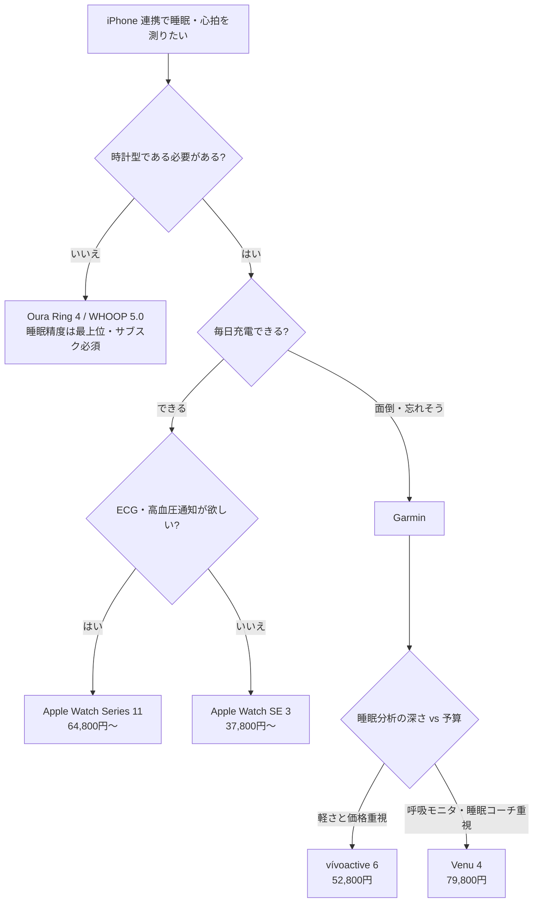

# iPhone 連携できる「睡眠の質・心拍数」計測スマートウォッチ調査

- 調査日: 2026-07-30
- 対象 Issue: [#1](https://github.com/bubbleShaker/gadget-research/issues/1)
- 要件: 睡眠の質を計測できる / 心拍数を計測できる / iPhone と連携できる

---

## 1. 結論（TL;DR）

| 優先したいこと | 推奨 | 価格（日本・税込） |
| --- | --- | --- |
| **iPhone 連携の快適さ込みで総合ベスト** | **Apple Watch Series 11** | 64,800円〜 |
| コストを抑えて始めたい | Apple Watch SE 3 | 37,800円〜 |
| **充電の手間を減らして毎晩確実に計測したい** | **Garmin vívoactive 6** | 52,800円 |
| 睡眠・リカバリー分析の精度最優先（時計でなくてよい） | Oura Ring 4 / WHOOP 5.0 | 52,800円〜＋サブスク |

**購入タイミングの注意**: Apple Watch Series 12 が **2026年9月（9/8〜9/15 あたり）に発表される見込み**。今は7月末なので、Apple Watch を狙うなら **9月の発表を待ってから** 買うのが合理的（新型を買う／型落ちの Series 11 を安く買う、どちらの選択肢も持てる）。

---

## 2. 評価軸

購入判断で効く軸を5つに絞った。

1. **iPhone 連携の深さ** — 通知の見やすさだけでなく、ヘルスケア App への統合、通知への返信可否、Apple エコシステム連携
2. **睡眠計測** — 睡眠ステージ、睡眠スコア、睡眠時無呼吸の検知、皮膚温
3. **心拍計測** — 安静時心拍、HRV（心拍変動）、ECG（心電図）、高血圧パターン通知
4. **バッテリー** — 睡眠計測では「いつ充電するか」が最大の運用課題。ここが実は満足度を左右する
5. **総コスト** — 本体価格 + サブスクリプション

> 補足: **HRV（心拍変動）** は心拍の「ゆらぎ」の大きさ。自律神経の状態を反映するとされ、睡眠中の HRV は各社が「回復度」「ストレス」スコアの主要な材料にしている。単なる心拍数より睡眠の質の指標として重視される。

---

## 3. 候補比較表

| | Apple Watch Series 11 | Apple Watch SE 3 | Apple Watch Ultra 3 | Garmin vívoactive 6 | Garmin Venu 4 | Fitbit Charge 6 | WHOOP 5.0 | Oura Ring 4 |
| --- | --- | --- | --- | --- | --- | --- | --- | --- |
| 形状 | 腕時計 | 腕時計 | 腕時計 | 腕時計 | 腕時計 | バンド型 | 画面なしバンド | 指輪 |
| 価格（税込） | 64,800円〜 | 37,800円〜 | 129,800円〜 | 52,800円 | 79,800円 | 約20,000〜23,800円 | 年44,092円〜（本体込） | 52,800円〜 |
| サブスク | 不要 | 不要 | 不要 | 不要 | 不要 | Premium 約1,400円/月（詳細分析に実質必須） | **必須**（止めると本体も止まる） | 月999円 / 年11,800円 |
| iPhone 連携 | ◎ ネイティブ | ◎ ネイティブ | ◎ ネイティブ | ○ Garmin Connect 経由 | ○ Garmin Connect 経由 | ○ Fitbit App 経由 | ○ 専用 App | ○ 専用 App |
| 睡眠スコア | ○ | ○ | ○ | ○ | ◎ 睡眠コーチ付き | ○ | ◎ | ◎ |
| 睡眠ステージ | ○ | ○ | ○ | ○ | ○ | ○ | ○ | ○ |
| 睡眠時無呼吸の通知 | ○ | ○ | ○ | －（Venu 4 のみ呼吸モニタ） | ○ 睡眠時呼吸モニタ | － | － | － |
| 皮膚温 | ○ | ○ | ○ | － | ○ | ○ | ○ | ○ |
| 心拍・HRV | ○ | ○ | ○ | ○ | ○ | ○ | ◎ | ◎ |
| ECG（心電図） | ○ | **×** | ○ | － | ○ | ○ | －（MG は対応） | － |
| 高血圧パターン通知 | ○（日本対応済み） | **×** | ○ | － | － | － | － | － |
| バッテリー | 約24時間（低電力 38時間） | 約18時間（低電力 36時間） | 約42時間 | **約11日** | **約12日（45mm）** | 約7日 | 約14日 | 約8日 |
| 防水 | 50m | 50m | 100m | 5ATM | 5ATM | 50m | 防水 | 100m |

### 睡眠計測にとってのバッテリーの意味

Apple Watch の「24時間持ちます」は、**日中つけて夜も睡眠計測する運用だと、実質毎日どこかで充電スロットを作る必要がある**という意味になる。Apple はこれを「入浴中や朝の支度中に充電する」前提で設計しており、Series 11 / SE 3 とも急速充電に対応（SE 3 は **8分の充電で8時間の睡眠計測が可能**）。習慣化できるなら問題ないが、「充電を忘れた日は睡眠データが欠ける」というリスクは残る。

Garmin は 10日以上持つので、この運用課題がほぼ消える。**睡眠計測を毎晩欠かさずやりたいなら Garmin が構造的に有利**、というのが今回の調査で一番効いたポイント。

---

## 4. デバイス別の詳細

### 4.1 Apple Watch Series 11 — iPhone ユーザーの本命

2025年9月発表。睡眠まわりで大きいのは **睡眠スコア**（0〜100点）の追加。内訳は明快で、

- 睡眠時間: 50点
- 就寝時刻の一貫性: 30点
- 中断（夜間の覚醒回数）: 20点

という配点。「深い睡眠が何%」といった当てにならない指標ではなく、**比較的確実に測れる要素だけでスコアを組んでいる**のは設計として誠実。

心拍まわりは Apple Watch 系で最も充実している。心拍数・ECG・血中酸素・**高血圧パターンの通知**（2025年12月から日本でも利用可能）・睡眠時無呼吸の通知が揃う。高血圧パターン通知は、30日間の装着データから高血圧の兆候を検出して知らせるもので、22歳以上・高血圧の診断歴がない人が対象。Series 9 以降と Ultra 2 以降が対象で、**SE は非対応**。

手首装着型の心拍計としては、この価格帯で最も正確という評価。バッテリーは公称24時間、低電力モードで38時間。

### 4.2 Apple Watch SE 3 — コスパ重視ならこれ

37,800円〜という価格ながら、SE 2 から大きく進化した。**常時表示ディスプレイ**、**皮膚温センサー**、**睡眠スコア**、**睡眠時無呼吸の通知** に対応。

一方で **ECG（心電図）と高血圧パターン通知は非対応**。ここが Series 11 との実質的な線引きになる。「睡眠の質と心拍数が測れればよく、医療寄りの心臓機能は要らない」なら SE 3 で要件は満たせる。バッテリーは18時間とやや短い。

### 4.3 Apple Watch Ultra 3 — 今回の要件にはオーバースペック

129,800円〜、GPS + Cellular のみ。100m 防水、約42時間のバッテリー、大画面。バッテリーが長いのは睡眠計測に有利だが、Series 11 の2倍の価格に見合うのは、登山・ダイビング・ウルトラマラソンといった用途がある場合に限られる。

### 4.4 Garmin vívoactive 6 / Venu 4 — 「充電しなくていい」が最大の武器

両機種とも睡眠ステージ・安静時心拍・**夜間 HRV** を計測し、睡眠スコアとコーチングを出す。

- **vívoactive 6（52,800円）**: 約11日持つ。**36g と軽く、寝るときに着けていて負担が少ない**（Venu 4 は金属筐体で重い）。睡眠計測目的なら装着快適性は無視できない要素。
- **Venu 4（79,800円）**: 皮膚温センサー、**睡眠時の呼吸モニタリング（いびき・無呼吸）**、カフェイン・アルコール摂取などの生活要因を織り込んだ睡眠コーチングに対応。睡眠分析としてはこちらが上位。**ECG（心電図）アプリは2025年4月23日に厚生労働省の認可を取得済みで、日本でも利用できる**。Suica にも対応。

iPhone との連携は Garmin Connect App 経由。通知の受信はできるが、**メッセージへの返信など iOS 側の制約で Apple Watch ほど深くは連携できない**。ヘルスケア App への同期は可能。

### 4.5 Fitbit Charge 6 — 安いが Premium 前提

約20,000〜23,800円で、フルカラー画面・40種のワークアウトモード・Fitbit として最も高度な心拍センサー。ただし詳細な睡眠分析には **Fitbit Premium（約1,400円/月）** が実質必要で、2年使うと Apple Watch SE 3 と総額が変わらなくなる。

### 4.6 WHOOP 5.0 / Oura Ring 4 — 睡眠・回復に特化

- **WHOOP 5.0**: 画面なしのバンド。日本では12ヶ月メンバーシップ込みで 44,092円程度。**サブスクを止めるとデバイスが動かなくなる**点に注意。睡眠データを日々のトレーニング負荷と結びつけた「リカバリースコア」が売り。
- **Oura Ring 4**: 指輪型のチタン製。Silver / Black が 52,800円、Brushed Silver / Stealth が 59,800円、Gold / Rose Gold が 74,800円（すべて税込）。加えてメンバーシップ 月999円 / 年11,800円（購入後1ヶ月無料）。iPhone 対応。指での計測は手首より血流信号を拾いやすく、睡眠計測の評価は高い。ただし**時計としての機能はゼロ**なので、今回の「スマートウォッチが欲しい」という要件からは外れる。

> 参考: **Galaxy Ring / Galaxy Watch は iPhone では使えない**（Samsung のエコシステム前提）。iPhone ユーザーは候補から除外してよい。

---

## 5. 睡眠計測の精度について（期待値の調整）

ここは購入前に理解しておいたほうがよい。

2025年の独立研究では、**深い睡眠の検出精度**は以下のとおり:

| デバイス | 深睡眠の検出精度 |
| --- | --- |
| WHOOP 4.0 | 69.6% |
| Apple Watch | 50.7% |
| Fitbit Sense | 48.3% |
| Fitbit Charge 5 | 43.3% |
| Withings | 29.8% |

つまり、**どの機種も「睡眠ステージ」の判定は当てにならない**。睡眠段階の判定は本来 PSG（睡眠ポリグラフ検査：脳波・眼球運動・筋電を測る）でしか正確にできず、腕の加速度と心拍から推定している以上、限界がある。

一方で **総睡眠時間・就寝／起床時刻・夜間の心拍とHRVの推移は、どの機種もそれなりに信頼できる**。Apple の睡眠スコアが「時間・一貫性・中断」だけで構成されているのは、この事情を踏まえた設計。

**使い方の指針**: 「昨夜の深い睡眠が◯分だった」を一喜一憂するのではなく、**同じデバイスで測った数週間のトレンド**（就寝時刻が安定してきたか、安静時心拍が下がってきたか）を見る。これが最も価値のある使い方。

---

## 6. 選択フロー

---

## 7. 購入タイミング

**Apple Watch Series 12 は 2026年9月8〜9日または15日に発表される見込み**（例年の iPhone 発表イベントと同時）。噂されている内容:

- 新型 S12 チップ、背面に8つのセンサーアレイ
- **手首だけで完結する血圧トレンドモニタリング**
- watchOS 27 で Apple Intelligence が Apple Watch に初対応（Series 9 以降）
- Touch ID 搭載の可能性
- 血糖値測定は「今年もロングショット」（実現可能性は低い）
- デザイン大刷新はなし（次の大改修は2028年予想）
- 米国で 429ドル前後スタートと、小幅な値上げの可能性

**判断**: 今から約6週間で発表なので、**Apple Watch を選ぶなら9月まで待つ**のが妥当。新機能が刺されば Series 12、刺さらなければ値下がりした Series 11 を買えばよく、待つことのデメリットがほぼない。

Garmin を選ぶ場合は、Venu 4 / vívoactive 6 とも2025年後半の製品でモデルサイクルの途中なので、待つ理由は薄い。

> 注意: Series 12 は**バンドの接続方式が変わる可能性**が噂されており、既存バンドが使えなくなるかもしれない。バンドを買い揃えるのは実機の仕様が判明してからにしたほうがよい。

---

## 8. 推奨アクション

1. **9月の Apple 発表を待つ**（約6週間）
2. 発表後、以下で判断する
   - 血圧トレンドモニタリングに魅力を感じる → Series 12
   - 特に刺さらない → 値下がりした Series 11（睡眠スコア・ECG・高血圧通知はこれで揃う）
   - 予算重視で ECG が不要 → SE 3
3. **毎日充電する運用に自信がない場合は、Apple を待たずに Garmin vívoactive 6** を検討する。「毎晩確実にデータが取れる」ほうが、機能の豊富さよりも睡眠改善には効く

---

## 9. 出典

- [Apple Watch Series 11 - Apple](https://www.apple.com/apple-watch-series-11/)
- [Apple debuts Apple Watch Series 11, featuring groundbreaking health insights - Apple Newsroom](https://www.apple.com/newsroom/2025/09/apple-debuts-apple-watch-series-11-featuring-groundbreaking-health-insights/)
- [本日より、Apple Watchで高血圧パターンの通知が利用可能に - Apple (日本)](https://www.apple.com/jp/newsroom/2025/12/hypertension-notifications-available-today-on-apple-watch/)
- [Apple Watch Series 11、SE 3、Ultra 3の違い。睡眠スコア＆5G対応スマートウォッチの選び方 - Business Insider Japan](https://www.businessinsider.jp/article/2509-how-to-choose-apple-watch-s11-se3-ultra3/)
- [【2025年最新版】Apple Watch SE 3・Series 11・Ultra 3の違いを徹底比較 - Smart Watch Life](https://www.smartwatchlife.jp/60334/)
- [フープ、「WHOOP 5.0」と「WHOOP MG」を発表 - Business Wire](https://www.businesswire.com/news/home/20250508766278/ja)
- [「睡眠」がわかる「Apple Watch Series 11」 64800円～ - Impress Watch](https://www.watch.impress.co.jp/docs/news/2046078.html)
- [Apple Watch、日本で「高血圧パターン」の通知に対応 - Impress Watch](https://www.watch.impress.co.jp/docs/news/2068503.html)
- [Apple Watch Series 11 offers new sleep features - AASM](https://aasm.org/apple-watch-series-11-offers-new-sleep-features/)
- [Apple Watch Series 11 review: The unshakeable formula - Wareable](https://www.wareable.com/apple/apple-watch-series-11-review)
- [Apple Watch SE 3登場！常時表示で"エントリーモデルの革命" - Smart Watch Life](https://www.smartwatchlife.jp/58306/)
- [Apple Watch Series 12は2026年9月に登場するのか？ - Smart Watch Life](https://www.smartwatchlife.jp/72692/)
- [Apple Watch Series 12 でバンドコレクションが全滅か - BigGo](https://finance.biggo.jp/news/202607030025_Apple_Watch_Series_12_redesign_may_end_band_compatibility)
- [vívoactive 6 - Garmin 日本](https://www.garmin.co.jp/products/wearables/vivoactive-6-black/)
- [心電図アプリ対応スマートウォッチ - Garmin 日本](https://www.garmin.co.jp/products/wearables/?cat=ecg)
- [ガーミン、ついに心電図対応 最新モデル以外も - Impress Watch](https://www.watch.impress.co.jp/docs/news/2009400.html)
- [Garmin Venu 4 vs Vivoactive 6 - gadgetsandwearables](https://gadgetsandwearables.com/2025/10/02/garmin-venu-4-vs-vivoactive-6/)
- [Garmin Venu 4 vs Vivoactive 6 - Woman & Home](https://www.womanandhome.com/health-wellbeing/fitness/garmin-venu-vs-vivoactive/)
- [Garmin Venu 4とvivoactive 6の違いを徹底比較 - トアブログ](https://toablog.jp/venu4-vivoactive6-hikaku/)
- [Fitbit Charge 6 - Google Store 日本](https://store.google.com/jp/product/fitbit_charge_6?hl=ja)
- [Fitbit Charge 6: これまでで最も先進的なトラッカー - Google Japan Blog](https://blog.google/intl/ja-jp/products/devices-services/fitbit-charge-6-jp/)
- [Wearable Accuracy Ranked: 17 Studies, 6 Devices (2026) - kygo](https://www.kygo.app/post/what-s-the-most-accurate-wearable-data-a-2024-2025-study-breakdown-by-device)
- [Best sleep trackers 2026 - Wareable](https://www.wareable.com/health-and-wellbeing/best-sleep-trackers-and-monitors)
- [The best sleep trackers 2026 - Tom's Guide](https://www.tomsguide.com/wellness/sleep-tech/best-sleep-tracker)
- [The best smartwatch for iPhone 2026 - TechRadar](https://www.techradar.com/news/best-smartwatch-for-iphone-what-great-watches-work-with-your-iphone)
- [Oura Ring 4 日本で発売 - TechnoEdge](https://www.techno-edge.net/article/2025/07/17/4490.html)
- [whoopの最新ウェアラブル完全比較ガイド - TECH NOTES](https://t-1.co.jp/media/complete-comparison-guide-whoop-wearable-50-mg-features-health-metrics-pricing-purchase-in-japan/)
- [【2026年】スマートリング おすすめ3選 - Neroの推しもの帳](https://sionero.hatenablog.com/entry/2026/06/05/120442)
